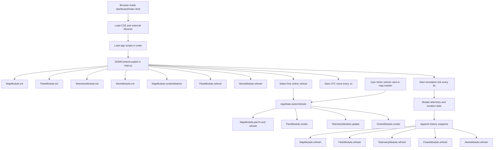

# FleetPulse Vehicle Telemetry Dashboard

## Overview
FleetPulse is a single-page vehicle telemetry dashboard built with HTML, CSS, and vanilla JavaScript. It visualizes a mock fleet in near real time with an interactive map, vehicle list, telemetry panel, KPI cards, trend charts, and alert feed.

## Key Features
- Fleet sidebar with search and status filters
- Interactive Leaflet map with vehicle markers and fit-to-view action
- Vehicle telemetry panel with gauges and detail table
- Trend charts for speed, temperature, battery, and fuel
- Alert feed with severity and dismiss actions
- Simulation loop that updates telemetry every 3 seconds
- Playwright end-to-end test suite with screenshot and video capture

## Tech Stack
- Frontend: HTML5, CSS3, Vanilla JavaScript
- Map: Leaflet
- Charts: Chart.js
- Testing: Playwright
- Runtime for tests: Node.js and npm

## Project Structure
```text
Training/
|- dashboard/
|  |- index.html
|  |- css/
|  |- js/
|     |- data/mockData.js
|     |- map.js
|     |- charts.js
|     |- fleet.js
|     |- telemetry.js
|     |- alerts.js
|     |- main.js
|- tests/
|  |- dashboard.spec.js
|- playwright.config.js
|- package.json
|- test-report/
|- test-results/
|- playwright-report/
```

## How To Run The Dashboard
1. Open dashboard/index.html in your browser.
2. The app bootstraps automatically and starts simulation updates.

## How To Run Tests
1. Install dependencies:

```bash
npm install
```

2. Run full test suite:

```bash
npm test
```

3. Run in headed mode:

```bash
npm run test:headed
```

4. Open Playwright UI mode:

```bash
npm run test:ui
```

## Test Artifacts And Reports
- JSON summary report: test-report/report.json
- HTML report: playwright-report/index.html
- Per-test screenshots and videos: test-results/

Current Playwright settings are configured to keep output artifacts and generate list, HTML, and JSON reports.

## System Flow
The application has two major flows:
- Initialization flow when the page loads
- Continuous simulation and user interaction flow



## Data And Module Responsibilities
- mockData.js: Fleet seed data, telemetry history, lookup helpers
- map.js: Map setup, marker rendering, pan and fit operations
- fleet.js: Sidebar list, filters, search, KPI rendering
- telemetry.js: Selected vehicle details and gauge drawing
- charts.js: Chart creation and refresh for selected vehicle history
- alerts.js: Alert rule checks, badge count, feed rendering, dismiss action
- main.js: App orchestration, initialization, clock, and simulation loop

## Notes
- This project is frontend-only and uses mock data.
- No backend service is required.
- Script load order in dashboard/index.html is important because modules share global state.
